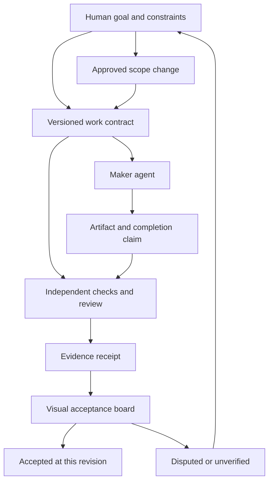

# Rumbo

Keep coding agents on the course you actually agreed to.

*Rumbo* is Spanish for a ship's course or heading.

**Direction:** agent-neutral coordination built around the user's intent, explicit constraints, and evidence of completed work.

**Available today (0.2.2):** a local Python decision-record/checking CLI and a Claude Code plugin adapter. People and agents with Python and file access can call the CLI directly. Automatic hooks and transcript handling are currently Claude Code-specific. Codex, OpenCode, and other native adapters are not yet shipped.

The roadmap below describes proposed capabilities, not features already implemented.

## What it does today

- records decisions in the user's exact words with a status (draft, preference, commitment, authorized, deferred, rejected, done, uncertain)
- computes schedule, deadline and budget checks with a script
- flags numeric check inputs that do not match the record's quote fields (see source-verification limits below)
- a prompt hook suggests starting a record when a message looks like planning; the nudge appears at most once per session
- a Claude Code Stop hook checks quotes against human messages when a readable, compatible transcript is available and blocks (up to three times per session) while a check fails, a value is unsourced, a quote is unverified, a check that was failing was deleted, or the record file is unreadable or invalid

## Standalone use with other agents

The Python core is provider-independent and uses only the standard library. An agent needs permission to run Python and read/write the project files. This is manual CLI use, not a native integration for every coding agent.

From this repository's root, replace `/path/to/project` and the example goal/message:

```sh
python3 rumbo/scripts/record.py init \
  --record /path/to/project/.rumbo/record.json \
  --objective "Plan a workshop" \
  --quote - <<'QUOTE'
Paste the user's exact words here.
QUOTE

python3 rumbo/scripts/record.py validate \
  --record /path/to/project/.rumbo/record.json

python3 rumbo/scripts/record.py check \
  --record /path/to/project/.rumbo/record.json

python3 rumbo/scripts/record.py show \
  --record /path/to/project/.rumbo/record.json \
  --max-chars 1500
```

Needs Python 3.9+. `init` creates empty items and checks arrays; the person or agent adds them by editing the JSON. The quoted heredoc preserves dollar signs and backticks. From another working directory, use an absolute path to `record.py`; the default record path is relative to the current directory. There is no installed `rumbo` executable in this release.

Without `--transcript`, `check` compares values with the record's quote fields; it does not establish that those quotes came from the user. Optional `--transcript /path/to/compatible-transcript.jsonl` adds lexical quote verification, but the current parser expects Claude-shaped JSONL. Other hosts need a trustworthy adapter; do not generate a transcript from the record's own quotes.

`validate` and `check` return 0 for clean results, 1 for content problems, and 2 for I/O/tool problems. `show` and `stop-gate` always exit 0. The Stop gate's JSON only blocks an agent when its host honors that protocol.

## Claude Code integration

The current automatic integration is for Claude Code:

```
/plugin marketplace add scking21/rumbo
/plugin install rumbo@rumbo
```

Needs Python 3.9+ and nothing else. To pin a version, add the marketplace at a tag or commit you have reviewed.

## How it works

The record lives at `.rumbo/record.json` in your project. Example:
```json
{
  "version": 1,
  "objective": {"text": "Plan a half-day workshop on March 12", "quote": "I'm organizing a half-day workshop on data visualization for our regional library association. It's the morning of March 12. The venue holds 40 people and we've budgeted $600 total.", "ref": "E1"},
  "items": [
    {"id": "I1", "text": "Schedule frame", "quote": "Please draft the schedule: 9:00 arrival, two 75-minute sessions with a 20-minute break, 12:30 close.", "ref": "E4", "status": "draft"},
    {"id": "I2", "text": "Maker-space session starts at 9:45", "quote": "The maker-space team just confirmed for the 9:45 session.", "ref": "E9", "status": "commitment"},
    {"id": "I3", "text": "Maker-space team only, for this workshop", "quote": "I think we should go with just the maker-space team for this workshop.", "ref": "E12", "status": "commitment", "scope": "this workshop only"},
    {"id": "I4", "text": "Budget caps", "quote": "Our budget review came back: the $600 total is firm, and no line item can exceed $300.", "ref": "E11", "status": "commitment"},
    {"id": "I5", "text": "Catering covered up to $200", "quote": "The library foundation said they'd cover catering up to $200 if registration is free.", "ref": "E3", "status": "commitment"},
    {"id": "I6", "text": "Printer deadline", "quote": "The printer needs final details by March 20: session titles, speaker names, and the schedule.", "ref": "E13", "status": "commitment"}
  ],
  "checks": [
    {"id": "C1", "kind": "fits_window", "label": "session schedule", "start": "09:45", "segments_min": [75, 20, 75], "end": "12:30", "refs": ["I1", "I2"]},
    {"id": "C2", "kind": "before", "label": "printer deadline precedes workshop", "first": "03-20", "second": "03-12", "refs": ["I6"]},
    {"id": "C3", "kind": "within_budget", "label": "budget", "amounts": [200], "total_cap": 600, "item_cap": 300, "refs": ["I4", "I5"]}
  ]
}
```

`rumbo/scripts/record.py` subcommands (from this repository's root):

- `validate`: checks the record for correctness
- `check`: validates and runs schedule/deadline/budget checks
- `show`: prints a compact summary for hook injection
- `init`: creates a new record with objective and quote
- `stop-gate`: Stop hook gate that blocks on conflicts or unsourced values

## Proposed direction: evidence-backed coordination

The next design explores two delivery tracks sharing one portable contract and evidence format. None of the features in this section are implemented in 0.2.2.

### Track 1: open-source Rumbo

A specialized supervisor that can work alongside different coding agents, with a local CLI/service, agent adapters, optional model provider, and a visual review board. Keep deterministic checks usable without a model. Distinguish manual/advisory integrations from adapters that can actually enforce a pause.

The core loop would be:

1. **Agree:** capture the original request, a structured interpretation, scope, forbidden changes, decision owner, budget, and acceptance checks
2. **Assign:** give a worker a bounded task with a versioned contract and an expiring claim so duplicate work is visible
3. **Produce:** submit an artifact and a completion claim
4. **Verify:** independently collect test/check evidence against that exact artifact and contract version
5. **Accept or escalate:** record what passed, what remains unverified, and which human decision is needed

A supervisor can coordinate this loop. It cannot give itself new authority or change the user's acceptance criteria.

### Track 2: OpenAI plugin

Expose the same engine through MCP tools, workflow skills, and an interactive plugin panel. An OpenAI agent should gain concrete capabilities: inspect the agreed scope, claim work, submit evidence, find contradictions, and request a narrowly scoped human decision.

- **Astra supervisor:** specialize through instructions, tools, retrieval, and evaluation to handle ambiguous intent and disputed evidence. Public Astra documentation does not support fine-tuning
- **Decisions API:** candidate for bounded routing such as continue / verify / replan / ask the human. OpenAI announced it at DevDay on September 29, 2026, using Luna with finite predefined answers. It launched in limited preview; integration depends on confirmed access and the published API contract
- **Deterministic checks:** remain responsible for concrete validation and state transitions. Model agreement does not establish correctness or authorization
- **Plugin extensions:** provide a visible project board beside the conversation
- **MCP Events:** candidate notifications for work ready, evidence submitted, blocked tasks, and changed requirements

A plugin can only observe or gate actions exposed through its integration. Installing it does not grant universal control over another agent's tools or session. Public directory submission and review are a separate step; no OpenAI plugin is currently shipped or approved.

Official references: [DevDay 2026 recap](https://openai.com/index/devday-2026-recap/), [Astra model](https://developers.openai.com/api/docs/models/gpt-6-astra), [Agents API multi-agent guide](https://developers.openai.com/api/docs/guides/agents-api/multi-agent), [plugin packaging](https://developers.openai.com/plugins/build/plugins), [MCP Events](https://developers.openai.com/plugins/build/mcp-events).

### Visual concept: follow intent through the work

Proposed flow:



The interface would show **what was agreed → who owns the work → what changed → what proves it → what needs a decision**.

Each requirement gets a row with its original words, owner, dependencies, artifact revision, check results, and unresolved objections. A lineage view shows which downstream work becomes stale when a decision changes. Clicking a passing result reveals its evidence. “Claimed complete,” “checks passed,” and “human accepted” remain distinct states.

Example: the user asks for CSV export with no new dependencies. The maker says it is finished. A dependency diff finds a new package, so the board shows the violated instruction and the proposed alternatives. The reviewer cannot turn the row green by agreeing with the maker.

### Mechanisms worth testing

These are design hypotheses, not claims of invention or demonstrated effectiveness.

- **Proof-carrying handoffs:** every task handoff includes the applicable instruction version, artifact identity, evidence, and unresolved caveats. The receiving agent acknowledges the acceptance conditions before starting
- **Stale-evidence propagation:** changing a requirement or artifact invalidates affected acceptance receipts and downstream dependencies, instead of leaving old approvals green
- **Blind first review:** the reviewer evaluates the artifact and contract before reading the maker's explanation, reducing anchoring. Disagreements must propose a discriminating check
- **Bounded challenges:** reserve a small review budget. A challenge needs a specific claim and evidence request; repeated debate ends in an explicit unresolved state
- **Evidence-based task allocation:** use observed estimate calibration and confirmed defects to improve routing. Permit abstention. Avoid reciprocal reviewer pairs. Reputation numbers are scheduling signals, not guarantees that agents have incentive-compatible behavior
- **Human decision rights:** scope changes go to the person who owns the constraint. Capture the smallest decision that unblocks work and show its consequences
- **A constrained orchestrator:** the “queen bee” allocates work and resolves scheduling conflicts, while an independent acceptance process preserves the rules. Avoid making one manager both the author of the rules and their sole judge

Start with a small referee and a review board. Add task-market and team-governance features only if controlled evaluations show they help.

### A ledger with an honest trust boundary

An append-only, hash-linked event log could record contracts, claims, checks, objections, and approvals. Signed checkpoints stored outside the coding agent's write control can make later alteration detectable.

Hashing a claim does not prove the claim is true, the test is sufficient, or every action was recorded. If one agent can rewrite the ledger, verifier, signing key, and checkpoints, the history can be replaced. Separate processes under the same writable account are not automatically independent security boundaries.

Use local/private logs by default. Consider independently witnessed logs only when the trust model calls for them. A blockchain is an option for mutually distrustful operators who genuinely need shared ordering, rather than a prerequisite for this project.

### What would make this useful enough to install?

Rumbo should supply durable, portable acceptance evidence that survives handoffs across agents and providers, while reducing false completion, repeated work, and human review effort.

A proposed first milestone is one project, two agent adapters, versioned work contracts, an independent reviewer, deterministic checks, and a local visual board. Test against current Rumbo, checks alone, a single agent with a self-review pass, and maker/reviewer pairs under comparable budgets.

Measure missed constraints, false acceptance, false blocks, task success, stale evidence, human interruptions, duplicate work, token cost, and wall time. Include requirement changes, conflicting owners, fabricated test claims, corrupted history, and reviewers agreeing on a wrong answer. Audit integrity and semantic correctness are different measurements.

### Prior art and design influences

Orchestration, ledgers, debate, and task negotiation already have precedents. The opportunity is a useful, tested combination centered on user-owned constraints and cross-agent acceptance evidence.

- [Magentic-One](https://microsoft.github.io/autogen/dev/user-guide/agentchat-user-guide/magentic-one.html): orchestrator and task/progress ledgers
- [Contract Net Protocol](https://cse-robotics.engr.tamu.edu/dshell/cs631/papers/smith80contract.pdf): negotiated task allocation
- [GitHub protected branches](https://docs.github.com/en/repositories/configuring-branches-and-merges-in-your-repository/managing-protected-branches/about-protected-branches): required checks and stale review handling
- [Closed-loop team communication](https://www.ahrq.gov/teamstepps-program/curriculum/communication/tools/loop.html): acknowledged handoffs
- [RFC 9162](https://www.rfc-editor.org/rfc/rfc9162.html): independently checkable append-only history

## Evidence

In a 20-run comparison on two synthetic planning conversations (Nemotron as the agent, with 3 of its calls in 2 runs served by a DeepSeek fallback; Kimi K3 grading against fixed rubrics), runs with Rumbo met 0.933 of required outcomes against 0.833 without, with 1.50 against 2.20 drift events, at about twice the wall time. It did not reduce invented facts: on one of the two conversations, runs with Rumbo invented a detail in 5 of 5 runs against 3 of 5 without, three of them a year forced by the date format this release no longer requires. The clearest effect: a schedule conflict (a 9:45 start that no longer fit a 12:30 close) was resolved or flagged in 3 of 5 runs with Rumbo and 0 of 5 without. Five runs per condition are too few to establish a reliable general effect; treat this as early evidence. Measured on 0.1.0 before dates without a year were allowed; that version made the agent invent a year in 3 of 5 runs, which the current `before` check no longer requires.

## Threat model

Rumbo is a memory aid against drift, not a sandbox against an agent that is trying to cheat. Quotes are verified against the transcript the harness writes, which the agent could still edit if it went out of its way to. Verification is lexical, not semantic: a quote must appear in one of the user's messages as whole words ("$900" does not match "$9000" or "$900.50") must not drop a minus sign in front of a number ("$900" does not match "Refund -$900"), and must not sit under a negation in the same clause ("spend $900" does not match "Do not spend $900"); it cannot tell whether the user meant it as a decision. record.json and the plugin's own files are editable by the agent. The Stop gate stops blocking after three attempts per session so it cannot trap a session, and anything still unresolved is visible in the conversation. The injected summary is marked as agent-written data, not instructions. `.rumbo/` holds the user's verbatim words, so add it to `.gitignore` before sharing a project.

## Limits

The record is a memory aid and never grants permission the user did not give; the agent can still ignore it outside the Stop hook; checks cover only times, dates and budgets.

### Source-verification limits in 0.2.2

- Source checks search the objective and all item quotes, including rejected or replaced items. A check's `refs` do not restrict that search. A matching value does not establish the correct decision, active scope, or authorization
- `check --transcript` reports an unreadable transcript as an error. The Stop hook instead skips quote verification when its transcript is missing or unreadable; it must not be treated as a fail-closed provenance gate
- Lexical quote matching cannot establish consent or semantic correctness. A proposed multi-agent verifier must address these boundaries explicitly
- The existing evidence above concerns synthetic planning tasks in 0.1.0, not the proposed coordination system or cross-agent compatibility

## Privacy

Rumbo's Python core runs locally and makes no direct network requests or telemetry submissions. If you provide its output to an AI host, that output may be processed by the service you use. In the included Claude Code integration, hook output (a summary of the record's text and checks, which may contain your words, and Stop reasons) enters your Claude conversation and is processed by the Claude service you use. See [PRIVACY.md](PRIVACY.md) for what it stores, what it reads and how to remove it.

## License

MIT, Copyright (c) 2026 Corby King.